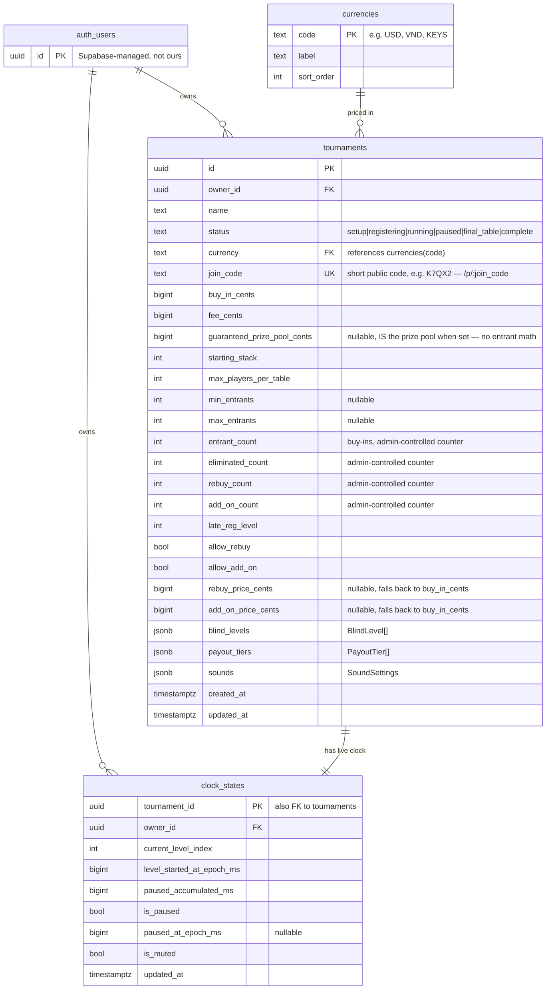

# poker-clock — Supabase schema

Entity-relationship diagram for `migrations/0001_init.sql` + `0002_currencies.sql` + `0003_public_projector.sql` + `0004_widen_money_columns.sql`. Keep this file in sync whenever a migration changes.

## Reading the diagram

- **`auth_users`** is Supabase's built-in `auth.users` table (not created by our migration) — both `tournaments` and `clock_states` have an `owner_id` pointing at it, `on delete cascade`. This is the whole multi-tenancy model: nothing is shared between organizers, and RLS on those two is just `owner_id = auth.uid()` for select/insert/update/delete.
- **`currencies`** is shared reference data, the same for every organizer — not owner-scoped, readable by anyone signed in (`for select using (true)`), and only ever written to via the dashboard/SQL editor, never by the app. This is what lets new currency units get added without a code change. It only affects prize pool/payout display — buy-in and fee are shown as plain numbers regardless of currency.
- **`tournaments`** is the only real per-user entity. There's no per-player roster: the app only ever needs *how many* — `entrant_count` (buy-ins), `eliminated_count`, `rebuy_count`, `add_on_count` — not *who*. All four are plain counters the admin increments/decrements live from the app, no join tables involved. Blind levels and payout tiers are likewise `jsonb` columns directly on the row rather than separate tables, since a tournament always owns exactly one of each.
- **`clock_states`** is a strict 1:1 with `tournaments` (`tournament_id` is both its primary key and its foreign key) — one live countdown row per tournament, added to the `supabase_realtime` publication so Control (writer) and Projector (reader) can run on different devices. The row's lifecycle mirrors Start/Stop, not just Start/Pause: **Start** upserts it, **Pause/Resume/level changes** update it, and **Stop** deletes it outright (the pre-existing `clock_states_delete_own` policy already allows this — no migration needed). Deleting it is what makes Stop mean "start over," not "resume where paused" — and it's also what the Control screen reads back via `fetch()` on mount, so refreshing or reopening the Control tab while a tournament is running/paused resumes the real remote clock instead of losing it locally.

## No per-player tables, on purpose

There is deliberately no `players`/`registrations` table — the app never surfaces individual player identity anywhere, only aggregate counts. Total-chips-in-play math assumes every rebuy/add-on grants the starting stack; prize pool math uses `rebuy_price_cents`/`add_on_price_cents` for their cost (falling back to `buy_in_cents` when unset — see `0006_rebuy_addon_price_drop_bounty.sql`).

## Public projector access (`0003_public_projector.sql`)

Typing a full UUID into a TV remote is unusable, so the projector view is reached by a short `join_code` (5 characters, unambiguous alphabet — no `0/O/1/I/L`) at `/p/:join_code`, and that route deliberately doesn't require signing in. Two different exposure mechanisms, on purpose:

- **`tournaments` stays fully owner-scoped** — RLS is unchanged. The public route instead calls `get_tournament_by_join_code(text)`, a `SECURITY DEFINER` SQL function that returns every tournament column *except* `owner_id`, and only for the one row matching the exact code. It can't be used to list or scan tournaments — there's no "get all" version, only exact lookup.
- **`clock_states` gets a real public `select using (true)` RLS policy.** Its contents (level index, pause state, timestamps) are low-sensitivity, and — importantly — Supabase Realtime enforces the table's RLS on `postgres_changes` subscriptions. An anonymous viewer can't receive *live* countdown updates at all unless the table itself is selectable by the `anon` role; there's no way to scope a Realtime subscription to "only the row matching a code you know," so this one is intentionally open to everyone rather than gated by a function like `tournaments` is.

The app polls `get_tournament_by_join_code` every few seconds from the projector page to keep slower-changing fields (player counts, prize pool) fresh, while the countdown itself updates instantly via the `clock_states` Realtime subscription.

## Money columns are `bigint`, not `integer` (`0004_widen_money_columns.sql`)

Every amount is stored ×100 (hundredths — same convention as Stripe's "smallest unit" cents). That's harmless for USD, but VND has no subunit, so a real guarantee like 200,000,000 VND becomes 20,000,000,000 once multiplied by 100 — past a 4-byte `integer`'s ~2.147 billion ceiling. Postgres rejected the write outright with an out-of-range error. `bigint` (up to ~9.2 × 10^18) has essentially unlimited headroom for this; the app's TS side was never the problem since it just uses a plain `number`.

Related: `guaranteedPrizePool` is a straight override, not a floor — `domain/rules/prizePool.ts`'s `calculatePrizePoolForTournament` returns it as-is whenever it's set, with zero entrant/buy-in math involved. It only computes `entries × buyIn` when there's no guarantee at all.

## Bounty removed, rebuy/add-on get their own price (`0006_rebuy_addon_price_drop_bounty.sql`)

The bounty feature (a flat amount per knockout) was removed entirely, including its `bounty_amount_cents` column. In its place, a rebuy and an add-on can each have their own price (`rebuy_price_cents`/`add_on_price_cents`) instead of always being assumed to cost `buy_in_cents` — set once at tournament setup, `null` meaning "not set, use `buy_in_cents`" for tournaments created before this shipped.

## Projector backgrounds (`media` bucket, `background/` folder — see `SETUP.md` step 4)

`tournaments.projector_background_id` (added in `0005`) used to only ever reference an id in a bundled config file — that migration's comment says as much. That bundled list is gone; projector backgrounds are now objects in a `background/` folder inside a public Storage bucket named `media` (the bucket is created by hand via the dashboard — same as user accounts — while its RLS policies are migration `0007`). Any signed-in user can upload images from the Settings page. `projector_background_id` holds the object's full in-bucket path (e.g. `background/uuid-name.jpg`), resolved to a URL at render time (`resolveBackgroundPath` in `src/infrastructure/supabase/SupabaseBackgroundRepository.ts`).

The bucket is Public so the unauthenticated `/p/:join_code` projector view can render a background by URL. But Public only governs direct object downloads — **listing** and **uploading** always go through RLS on `storage.objects`, so `0007` adds `authenticated`-role `select`/`insert` policies scoped to the `media` bucket. Without them the Settings page's `list()` returns an empty array (no error), even though the objects exist and their public URLs resolve.

## Not shown

Row-level security policies, indexes, and the `set_updated_at` trigger are omitted here for readability — see the migration files themselves for those.
