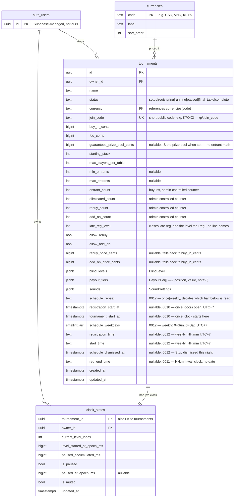

# poker-clock — Supabase schema

Entity-relationship diagram for `migrations/0001_init.sql` + `0002_currencies.sql` + `0003_public_projector.sql` + `0004_widen_money_columns.sql`. Keep this file in sync whenever a migration changes.

```mermaid
erDiagram
    auth_users ||--o{ tournaments  : owns
    auth_users ||--o{ clock_states : owns
    tournaments ||--|| clock_states : "has live clock"
    currencies  ||--o{ tournaments : "priced in"

    auth_users {
        uuid id PK "Supabase-managed, not ours"
    }

    currencies {
        text code PK "e.g. USD, VND, KEYS"
        text label
        int sort_order
    }

    tournaments {
        uuid id PK
        uuid owner_id FK
        text name
        text status "setup|registering|running|paused|final_table|complete"
        text currency FK "references currencies(code)"
        text join_code UK "short public code, e.g. K7QX2 — /p/:join_code"
        bigint buy_in_cents
        bigint fee_cents
        bigint guaranteed_prize_pool_cents "nullable, IS the prize pool when set — no entrant math"
        int starting_stack
        int max_players_per_table
        int min_entrants "nullable"
        int max_entrants "nullable"
        int entrant_count "buy-ins, admin-controlled counter"
        int eliminated_count "admin-controlled counter"
        int rebuy_count "admin-controlled counter"
        int add_on_count "admin-controlled counter"
        int late_reg_level "closes late reg, and the level the Reg End line names"
        bool allow_rebuy
        bool allow_add_on
        bigint rebuy_price_cents "nullable, falls back to buy_in_cents"
        bigint add_on_price_cents "nullable, falls back to buy_in_cents"
        jsonb blind_levels "BlindLevel[]"
        jsonb payout_tiers "PayoutTier[] — { position, value, note? }"
        jsonb sounds "SoundSettings"
        text schedule_repeat "0012 — once|weekly, decides which half below is read"
        timestamptz registration_start_at "nullable, 0010 — once: doors open, UTC+7"
        timestamptz tournament_start_at "nullable, 0010 — once: clock starts here"
        smallint_arr schedule_weekdays "0012 — weekly: 0=Sun..6=Sat, UTC+7"
        text registration_time "nullable, 0012 — weekly: HH:mm UTC+7"
        text start_time "nullable, 0012 — weekly: HH:mm UTC+7"
        timestamptz schedule_dismissed_at "nullable, 0012 — Stop dismissed this night"
        text reg_end_time "nullable, 0011 — HH:mm wall clock, no date"
        timestamptz created_at
        timestamptz updated_at
    }

    clock_states {
        uuid tournament_id PK "also FK to tournaments"
        uuid owner_id FK
        int current_level_index
        bigint level_started_at_epoch_ms
        bigint paused_accumulated_ms
        bool is_paused
        bigint paused_at_epoch_ms "nullable"
        bool is_muted
        timestamptz updated_at
    }
```

## Reading the diagram

- **`auth_users`** is Supabase's built-in `auth.users` table (not created by our migration) — both `tournaments` and `clock_states` have an `owner_id` pointing at it, `on delete cascade`. This is the whole multi-tenancy model: nothing is shared between organizers, and RLS on those two is just `owner_id = auth.uid()` for select/insert/update/delete.
- **`currencies`** is shared reference data, the same for every organizer — not owner-scoped, readable by anyone signed in (`for select using (true)`), and only ever written to via the dashboard/SQL editor, never by the app. This is what lets new currency units get added without a code change. It only affects prize pool/payout display — buy-in and fee are shown as plain numbers regardless of currency.
- **`tournaments`** is the only real per-user entity. There's no per-player roster: the app only ever needs *how many* — `entrant_count` (buy-ins), `eliminated_count`, `rebuy_count`, `add_on_count` — not *who*. All four are plain counters the admin increments/decrements live from the app, no join tables involved. Blind levels and payout tiers are likewise `jsonb` columns directly on the row rather than separate tables, since a tournament always owns exactly one of each.
- **`clock_states`** is a strict 1:1 with `tournaments` (`tournament_id` is both its primary key and its foreign key) — one live countdown row per tournament, added to the `supabase_realtime` publication so Control (writer) and Projector (reader) can run on different devices. The row's lifecycle mirrors Start/Stop, not just Start/Pause: **Start** upserts it, **Pause/Resume/level changes** update it, and **Stop** deletes it outright (the pre-existing `clock_states_delete_own` policy already allows this — no migration needed). Deleting it is what makes Stop mean "start over," not "resume where paused" — and it's also what the Control screen reads back via `fetch()` on mount, so refreshing or reopening the Control tab while a tournament is running/paused resumes the real remote clock instead of losing it locally.

## No per-player tables, on purpose

There is deliberately no `players`/`registrations` table — the app never surfaces individual player identity anywhere, only aggregate counts. Total-chips-in-play math assumes every rebuy/add-on grants the starting stack; prize pool math uses `rebuy_price_cents`/`add_on_price_cents` for their cost (falling back to `buy_in_cents` when unset — see `0006_rebuy_addon_price_drop_bounty.sql`).

## Public projector access (`0003_public_projector.sql`)

Typing a full UUID into a TV remote is unusable, so the projector view is reached by a short `join_code` (5 characters, unambiguous alphabet — no `0/O/1/I/L`) at `/p/:join_code`, and that route deliberately doesn't require signing in. Two different exposure mechanisms, on purpose:

- **`tournaments` stays fully owner-scoped** — RLS is unchanged. The public route instead calls `get_tournament_by_join_code(text)`, a `SECURITY DEFINER` SQL function that returns every tournament column *except* `owner_id`, and only for the one row matching the exact code. It can't be used to list or scan tournaments — there's no "get all" version, only exact lookup.
- **`clock_states` gets a real public `select using (true)` RLS policy.** Its contents (level index, pause state, timestamps) are low-sensitivity, and — importantly — Supabase Realtime enforces the table's RLS on `postgres_changes` subscriptions. An anonymous viewer can't receive *live* countdown updates at all unless the table itself is selectable by the `anon` role; there's no way to scope a Realtime subscription to "only the row matching a code you know," so this one is intentionally open to everyone rather than gated by a function like `tournaments` is.

The app polls `get_tournament_by_join_code` every few seconds from the projector page to keep slower-changing fields (player counts, prize pool) fresh, while the countdown itself updates instantly via the `clock_states` Realtime subscription.

## Money columns are `bigint`, not `integer` (`0004_widen_money_columns.sql`)

Every amount is stored ×100 (hundredths — same convention as Stripe's "smallest unit" cents). That's harmless for USD, but VND has no subunit, so a real guarantee like 200,000,000 VND becomes 20,000,000,000 once multiplied by 100 — past a 4-byte `integer`'s ~2.147 billion ceiling. Postgres rejected the write outright with an out-of-range error. `bigint` (up to ~9.2 × 10^18) has essentially unlimited headroom for this; the app's TS side was never the problem since it just uses a plain `number`.

Related: `guaranteedPrizePool` is a straight override, not a floor — `domain/rules/prizePool.ts`'s `calculatePrizePoolForTournament` returns it as-is whenever it's set, with zero entrant/buy-in math involved. It only computes `entries × buyIn` when there's no guarantee at all.

## Bounty removed, rebuy/add-on get their own price (`0006_rebuy_addon_price_drop_bounty.sql`)

The bounty feature (a flat amount per knockout) was removed entirely, including its `bounty_amount_cents` column. In its place, a rebuy and an add-on can each have their own price (`rebuy_price_cents`/`add_on_price_cents`) instead of always being assumed to cost `buy_in_cents` — set once at tournament setup, `null` meaning "not set, use `buy_in_cents`" for tournaments created before this shipped.

## Projector backgrounds (`media` bucket, `background/` folder — see `SETUP.md` step 4)

`tournaments.projector_background_id` (added in `0005`) used to only ever reference an id in a bundled config file — that migration's comment says as much. That bundled list is gone; projector backgrounds are now objects in a `background/` folder inside a public Storage bucket named `media` (the bucket is created by hand via the dashboard — same as user accounts — while its RLS policies are migration `0007`). Any signed-in user can upload images from the Settings page. `projector_background_id` holds the object's full in-bucket path (e.g. `background/uuid-name.jpg`), resolved to a URL at render time (`resolveBackgroundPath` in `src/infrastructure/supabase/SupabaseBackgroundRepository.ts`).

The bucket is Public so the unauthenticated `/p/:join_code` projector view can render a background by URL. But Public only governs direct object downloads — **listing** and **uploading** always go through RLS on `storage.objects`, so `0007` adds `authenticated`-role `select`/`insert` policies scoped to the `media` bucket. Without them the Settings page's `list()` returns an empty array (no error), even though the objects exist and their public URLs resolve.

## Not shown

## Scheduled start (`0010_tournament_schedule.sql`)

`registration_start_at` and `tournament_start_at` are both nullable — an unscheduled tournament, the norm, has neither and is started by hand exactly as before. They are real `timestamptz` columns rather than keys in the `projector` jsonb bag because the clock starts itself off `tournament_start_at`: the value has to be something Postgres can type-check and compare, not presentation.

Instants are stored in UTC; the organiser picks them in UTC+7 (`src/domain/rules/tournamentSchedule.ts` owns that conversion, and ICT's lack of DST is why a fixed offset is the whole rule). Once `registration_start_at` passes, the tournament's status moves to `registering` and the projector counts down to `tournament_start_at`; when that arrives the Control screen starts the clock. With no `tournament_start_at` set, registration stays open and the admin starts it manually.

Both columns are exposed through `get_tournament_by_join_code`, which `0010` re-declares — the TV is the screen that has to show the countdown, and anything missing from that function is invisible to it.

## Registration close announcement (`0011_registration_end.sql`)

The projector prints `Reg End: Level 8 ( 20h30 )` under the buy-in/re-buy/stack line. Only the time is new here — the level is `late_reg_level`, which already exists and already means exactly this. Deliberately not a second column: the sign on the TV and the rule the app enforces (`isLateRegClosed`) are one number and cannot drift apart. `late_reg_level` of 0 announces nothing.

`reg_end_time` is a bare time of day, stored as text in `HH:mm` rather than as a `time`: it's the exact string `<input type="time">` produces, and `time`'s `HH:MM:SS` would need trimming on every read for precision nobody enters. There is deliberately no date — the room reads the time off the wall, and a tournament running behind simply reaches the level later than the sign says.

Either half may stand alone: level with no time reads `Reg End: Level 8`, time with no level reads `Reg End: 20h30`. `0011` re-declares `get_tournament_by_join_code` to expose the column, since the projector is the only screen this line is for.

Row-level security policies, indexes, and the `set_updated_at` trigger are omitted here for readability — see the migration files themselves for those.

## Repeating schedules, run by the database (`0012_weekly_schedule_and_cron.sql`)

Two changes that only make sense together.

**Repeating.** A dated schedule describes one evening, so stopping the run clears it and the organiser enters tomorrow's date tomorrow — a club that runs every Friday was doing that weekly. `schedule_repeat` decides which half of the schedule is read: `once` uses `registration_start_at` + `tournament_start_at`; `weekly` uses `schedule_weekdays` (0 = Sunday … 6 = Saturday, UTC+7) plus `registration_time` and `start_time` (`HH:mm`, UTC+7, same day). Times of day are text, matching `reg_end_time` and the string `<input type="time">` produces.

Nothing outside `src/domain/rules/tournamentSchedule.ts` knows there are two shapes: `scheduleOccurrence` resolves either to the two instants of the occurrence in play, and the phase, the registration countdown and the derived clock all read that. A weekly occurrence is current from its registration time for 24 hours — long enough for a night running past midnight, over well before the next week, so the TV announces the coming night rather than sitting on a stale result.

`schedule_dismissed_at` is the Dismiss half of an alarm. Stop on a weekly tournament records the instant instead of clearing the days, and occurrences that opened at or before it are skipped — the next day on the list still fires. Turning the arrangement off means clearing `schedule_weekdays` in setup. Stop on a dated schedule still clears the two instants, since that schedule described one evening.

**Run by the database.** Every scheduled transition used to need a browser. The screens *derive* the registration board and the clock from the schedule, so a TV that is on shows the right thing at the right second — but the `status` a dashboard reads, the `clock_states` row a run needs, and the eventual `finished` were only ever written by an open control screen. A club that sets a Friday alarm and closes the app is entitled to have Friday happen.

`advance_tournament_schedules()` does those writes and `pg_cron` calls it every minute, covering both ends of the lifecycle:

| At | Write |
|---|---|
| Registration time | `status: setup → registering` |
| Start time | `status → running`, insert `clock_states` with `level_started_at_epoch_ms` = the scheduled instant |
| Last level runs out | `status → finished` |

It is idempotent: every branch is guarded on the status it changes and the clock row is an `on conflict do nothing` insert, so repeated runs cost nothing. The start instant is used rather than `now()`, so a tournament the job reaches late is late-into-itself, not starting fresh — the same rule the client uses when adopting a derived clock. Finishing applies to manually started tournaments too, since the status should be true whoever started it, and it changes only the status: the clock row is left alone so the result keeps showing until the admin stops the tournament. The function is `security definer` and writes across owners, so it is revoked from `public` — only the scheduler may call it.

Stop stays authoritative over the job. It deletes the clock row and either clears a dated schedule or records `schedule_dismissed_at`, so `tournament_occurrence` stops returning an evening that has started and there is nothing left to re-insert.

A minute is the job's resolution because a minute is the resolution a schedule is set at. It is only the bookkeeping cadence — the room still sees the countdown update every 250ms.

**Known duplication.** `tournament_occurrence()` restates `scheduleOccurrence`, and `tournament_clock_finished()` restates `isClockFinished` from `src/domain/rules/blindProgression.ts`. Both are deliberate — the screens cannot ask the database every 250ms, and a status that only updates when somebody is looking is not a status — and both can drift, so change each pair together. The schedule half is meant to be collapsed by having the API return the resolved instants, at which point the client stops computing them at all.
